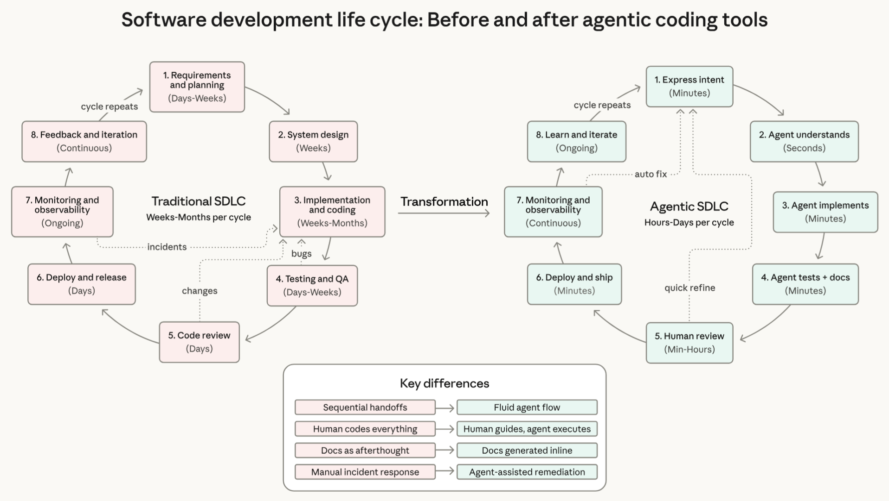

<!-- 
_class: invert lead
_paginate: skip
 -->

# Generative AI, ethics, and policies

COMP 4630 | Winter 2026
Charlotte Curtis

---

## Guiding questions for discussion
- What are some ways that AI can be helpful? Harmful?
- What are some ways that AI is used?
    - Axes: intent (malicious <-> innocent), impact (harmful <-> helpful)
- What concerns do you have about AI in general?
    - What about in education, specifically at MRU?
- What would you like to see in an AI policy at MRU?

---

## Case study: vibe coding

Costs* of:
- Voice to text
- Code generation
- Debugging
- at ~[3 Wh/request](https://www.sciencedirect.com/science/article/pii/S2542435123003653)

<footer>*Carbon footprint, $$, scalability, security, etc</footer>

---

<footer>Source: <a href="https://resources.anthropic.com/hubfs/2026%20Agentic%20Coding%20Trends%20Report.pdf">Anthropic</a></footer>

---

## April fools?
- Yesterday (March 31st, 2026), Claude Code's source code was [accidentally leaked](https://news.ycombinator.com/item?id=47584540)
- It's an interesting code base to browse through, notably:
    - [April Fool's day buddy sprite](https://github.com/chatgptprojects/claude-code/blob/9800e588397787f32bae8c4e9e62cc86462e81b8/src/buddy/useBuddyNotification.tsx)
    - [Negative keyword matching](https://github.com/chatgptprojects/claude-code/blob/9800e588397787f32bae8c4e9e62cc86462e81b8/src/utils/userPromptKeywords.ts)
    - [Undercover mode](https://github.com/chatgptprojects/claude-code/blob/9800e588397787f32bae8c4e9e62cc86462e81b8/src/utils/undercover.ts)

---

## Impact
- How do you, as CS majors, feel about these trends?
- Have you tried using agentic coding tools?
- What is the true cost of agentic coding?
    - A [recent paper](https://arxiv.org/abs/2601.14470) attempts to quantify token usage by task
    - [Environmental impact](https://wedocs.unep.org/rest/api/core/bitstreams/07b3c8fc-bd30-4b92-b5f4-d665e927b59d/content), [energy consumption](https://spectrum.ieee.org/ai-energy-use), [financial cost](https://developers.openai.com/api/docs/pricing)

---

## Coming up next
<!-- _class: invert  -->
- Easter break, no class on Monday
- Wednesday: One last journal club presentation ([YOLO](https://arxiv.org/abs/1506.02640)) and a smattering of additional topics (autoencoders, object detection, image generation?)
- Monday: last day of class! Assignment 3 results, project checkpoint discussions. Maybe some kind of treats.